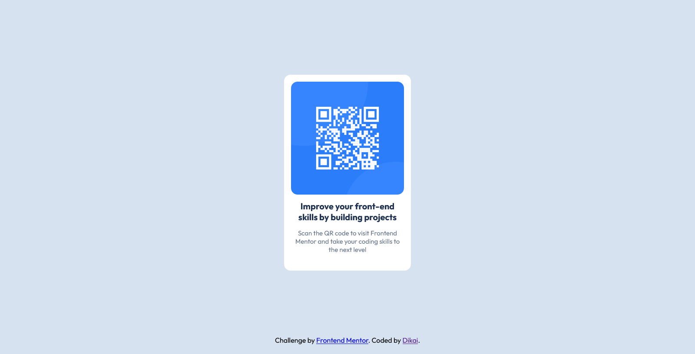

# Frontend Mentor - QR code component solution

This is a solution to the [QR code component challenge on Frontend Mentor](https://www.frontendmentor.io/challenges/qr-code-component-iux_sIO_H). Frontend Mentor challenges help you improve your coding skills by building realistic projects. 

## Table of contents

- [Descripción](#descripción)
  - [Screenshot](#screenshot)
  - [Links](#links)
- [Proceso](#proceso)
  - [Trabajé con](#trabajé-con)
  - [Lo que aprendí](#lo-que-aprendí)
  - [Desarrollo continuo](#desarrollo-continuo)
  - [Recursos útiles](#recursos-útiles)
  - [Colaboración con la IA](#colaboración-con-la-ia)
- [Autor](#autor)

## Descripción

### Screenshot



### Links

- URL de la solución: pendiente de enviar
- URL del sitio en vivo: [Ver sitio en vivo](https://qr-dikaifrontend.netlify.app/)

## Proceso

### Trabajé con

- HTML5
- Propiedades personalizadas de CSS (custom properties)
- Flexbox

### Lo que aprendí

Gracias a este proyecto, pude mejorar en el manejo de contenedores y el uso correcto de flexbox.

```html
<body>
  <main class="QR-Body">
    <div class="contenedor-campos">
      <div class="qr-image">
        
      </div>
      <div class="titulo">
        <h1>Improve your front-end skills by building projects</h1>
      </div>
      <div class="parrafo">
        <p>Scan the QR code to visit Frontend Mentor and take your coding skills to the next level</p>
      </div>
    </div>
  </main>

  <footer class="attribution">
    Challenge by <a href="https://www.frontendmentor.io?ref=challenge">Frontend Mentor</a>. 
    Coded by <a href="https://www.frontendmentor.io/profile/SebasKai">Dikai</a>.
  </footer>
</body>
```

En general todo el código HTML fue sencillo y además logré seccionar de buena manera todo el contenido.

```css
body{
    display: flex;
    flex-direction: column;
    justify-content: center;
    align-items: center;
    margin: 0;
    background-color: var(--fondo);
    font-size: 16px;
    font-family: "Outfit", sans-serif;
    min-height: 100vh;
}
```

Logré definir bien el body de mi página web usando flexbox.

```css
.contenedor-campos{
    margin-bottom: 15rem;
    padding: 1.6rem;
    background-color: var(--blanco);
    border-radius: 1.5rem;
    max-width: 26rem;
}
```

### Desarrollo continuo

Seguiré especializándome en las áreas de desarrollo web, además de otras areas como manejo de bases de datos, API REST, y desarrollo de IA.

### Recursos útiles

- [Google Fonts](https://fonts.google.com/) - En general me encanta para encontrar nuevas fonts que sean útiles para destacar el contenido.

### Colaboración con la IA

En lo personal uso Claude Code para la ayuda en el desarrollo, es sin duda una de las mejores IA's que existen actualmente.

Principalmente la utilicé para:

- Apoyarme en la parte del flexbox ya que aún no estoy muy familiarizado con esa herramienta.
- Lluvia de ideas de cómo el diseño podría mejorar.
- Arreglar errores pequeños.

## Autor

- Website - [qr-dikaifrontend.netlify.app](https://qr-dikaifrontend.netlify.app/)
- Frontend Mentor - [@SebasKai](https://www.frontendmentor.io/profile/SebasKai)
